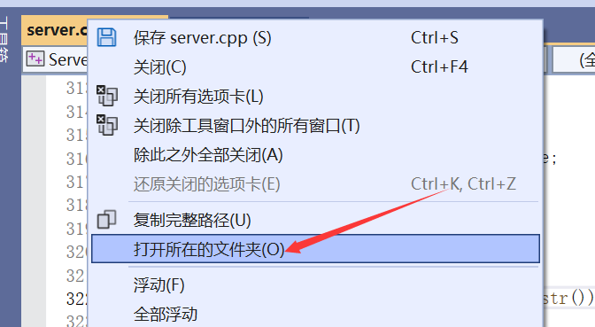

## 目前实现的功能

- 查看当前在线的用户
- 查看当前客户端目录下的所有文件
- 查看服务端目录下的所有文件
- 与指定的用户进行聊天
- 向所有用户发送广播消息
- 向服务端发送或者下载文件
- 向指定的用户发送文件

## 使用

### 环境配置

用到了jsoncpp这个库，配置记录一下方便后面继续上手，下面的步骤针对windows

去 [jsoncpp](https://github.com/open-source-parsers/jsoncpp) 的 github 下载源码，然后用cmake编译，cmake去官网安装，默认下一步即可。

打开cmake-gui

创建一个jsoncpp的库目录，比如“C:\Jsoncpp”，然后去 C:\Users\xxxx\Documents\jsoncpplib 目录下把include目录拷贝到 C:\Jsoncpp，除了CMakeFiles目录其他文件可以删除，然后再在 C:\Jsoncpp 下创建一个 lib 的目录， 之后去 C:\Users\\xxxx\Documents\jsoncpplib\bin\Debug 目录下把jsoncpp.dll拷贝到 C:\Jsoncpp\lib，还有一个文件 C:\Users\\xxxx\Documents\jsoncpplib\lib\Debug\jsoncpp.lib 也需要拷贝到 lib 下。

之后就是vs的配置。

因为只在Server项目使用了jsoncpp库，所以只需要配Server就行

添加这两个

然后编译运行试试，如果报错了，把 jsoncpp.dll 文件放在Server的可执行文件目录下，应该就解决了。

### 用法

启动后在客户端输入用户名和密码，用户名和密码存储在Server当前目录下的 users.json 文件下，查看json文件

登录后输入 /help 即可查看用户命令。
